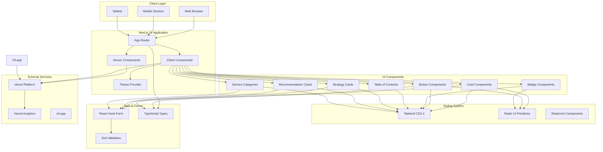
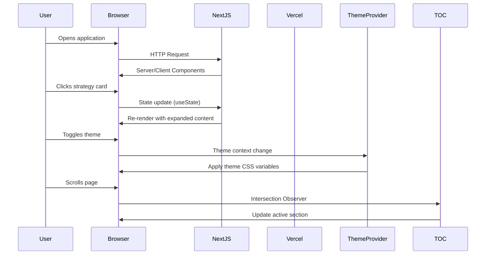

# New Client Proposals

*A comprehensive financial planning client proposal application*

[](https://vercel.com/gileb64375-5584s-projects/v0-new-client-proposals)
[](https://v0.app/chat/projects/GsC8QMXr22k)
[](https://nextjs.org)
[](https://www.typescriptlang.org)
[](https://tailwindcss.com)

---

## Table of Contents

- [Overview](#overview)
- [Key Features](#key-features)
- [Dev Stack](#dev-stack)
- [System Architecture](#system-architecture)
- [Configuration](#configuration)
- [Project Stats](#project-stats)
- [Getting Started](#getting-started)
- [Development Commands](#development-commands)
- [Project Structure](#project-structure)
- [Environment Variables](#environment-variables)
- [Deployment](#deployment)

---

## Overview

This repository contains a **New Client Proposal** application for **Iconoclastic Capital Management**, a financial planning firm. The application serves as an interactive, professional proposal system designed to help financial advisors present comprehensive wealth management strategies to potential clients.

> **Note:** This repository stays in sync with deployed chats on [v0.app](https://v0.app). Any changes made to the deployed app are automatically pushed to this repository.

---

## Key Features

### Core Functionality

- **Interactive Strategy Cards** - Expandable cards displaying financial strategies with tags (Priority, Risk, Tax, Income, Estate, Health, Implementation)
- **Recommendation System** - Step-by-step recommendations with expandable details
- **Service Categories** - 9 comprehensive financial planning service categories:
  - Retirement and Income Planning
  - Tax Planning & Optimization
  - Cash Flow and Budget Management
  - Investment Planning & Management
  - Risk Management & Insurance Planning
  - Estate & Legacy Planning
  - Education & College Planning
  - Business & Entrepreneurial Planning
  - Behavioral & Emotional Support

- **Dynamic Table of Contents** - Sticky navigation with scroll-based active section highlighting
- **Mobile-Responsive Design** - Fully responsive layout with mobile TOC toggle
- **Service Model Selection** - Three-tier service pricing model (Asset Management, Guided Wealth Management, Project-Based Planning)

### UI/UX Features

- **Dark/Light Theme Support** - Built with `next-themes` for theme switching
- **Smooth Animations** - CSS transitions and hover effects
- **Accessible Components** - Using Radix UI primitives for accessibility
- **Responsive Grid Layout** - Adaptive layouts for all screen sizes

---

## Dev Stack

### Frontend

| Technology | Version | Purpose |
|------------|---------|---------|
| **Next.js** | 14.2.16 | React framework with App Router |
| **React** | 18 | UI library |
| **TypeScript** | 5 | Type safety |
| **Tailwind CSS** | 4.1.9 | Utility-first CSS framework |
| **Lucide React** | 0.454.0 | Icon library |

### UI Components

| Library | Purpose |
|---------|---------|
| **Radix UI** | Accessible UI primitives (Dialog, Dropdown, Accordion, etc.) |
| **Shadcn/ui** | Pre-built component library |
| **Class Variance Authority** | Component variant management |
| **Tailwind Merge** | Tailwind class merging utility |

### Data & Forms

| Library | Purpose |
|---------|---------|
| **React Hook Form** | Form handling |
| **Zod** | Schema validation |
| **Date-fns** | Date manipulation |

### Visualization

| Library | Purpose |
|---------|---------|
| **Recharts** | Chart components |
| **Embla Carousel** | Touch-friendly carousel |

### Deployment & Analytics

| Library | Purpose |
|---------|---------|
| **Vercel Analytics** | Performance tracking |
| **Vercel** | Hosting platform |

---

## System Architecture



### Architecture Flow



---

## Configuration

### TypeScript Configuration

```json
{
  "compilerOptions": {
    "lib": ["dom", "dom.iterable", "esnext"],
    "allowJs": true,
    "skipLibCheck": true,
    "strict": true,
    "noEmit": true,
    "esModuleInterop": true,
    "module": "esnext",
    "moduleResolution": "bundler",
    "resolveJsonModule": true,
    "isolatedModules": true,
    "jsx": "preserve",
    "incremental": true,
    "plugins": [{ "name": "next" }],
    "paths": {
      "@/*": ["./*"]
    }
  },
  "include": ["next-env.d.ts", "**/*.ts", "**/*.tsx", ".next/types/**/*.ts"],
  "exclude": ["node_modules"]
}
```

### Tailwind Configuration

- **Version:** 4.1.9
- **PostCSS:** `@tailwindcss/postcss`
- **Plugins:** `tailwindcss-animate`, `tw-animate-css`
- **CSS Framework:** Using Tailwind v4 with CSS-based configuration

### Next.js Configuration

```javascript
/** @type {import('next').NextConfig} */
const nextConfig = {
  // App Router enabled by default in Next.js 14
  // Additional configurations can be added here
}

export default nextConfig
```

---

## Project Stats

| Metric | Value |
|--------|-------|
| **Total Files** | ~45 files |
| **Source Files** | 25+ TypeScript/React files |
| **Components** | 8+ UI components |
| **Dependencies** | 60+ packages |
| **Dev Dependencies** | 8 packages |
| **Package Manager** | pnpm |
| **Node Version** | 18+ |

---

## Getting Started

### Prerequisites

- **Node.js** 18.x or higher
- **pnpm** 8.x or higher (recommended)
- **npm** 9.x or higher (alternative)

### Installation

```bash
# Clone the repository
git clone <repository-url>
cd new-client-proposals

# Install dependencies using pnpm (recommended)
pnpm install

# Or using npm
npm install

# Or using yarn
yarn install
```

### Development Server

```bash
# Start development server
pnpm dev

# Or with npm
npm run dev
```

Open [http://localhost:3000](http://localhost:3000) in your browser to view the application.

---

## Development Commands

| Command | Description |
|---------|-------------|
| `pnpm dev` | Start development server |
| `pnpm build` | Build for production |
| `pnpm start` | Start production server |
| `pnpm lint` | Run ESLint for code linting |
| `pnpm lint:fix` | Auto-fix linting issues |

---

## Project Structure

```
new-client-proposals/
├── app/                        # Next.js App Router
│   ├── layout.tsx             # Root layout with theme provider
│   ├── page.tsx               # Main proposal page
│   ├── globals.css            # Global styles
│   └── favicon.ico            # Favicon
├── components/
│   ├── ui/                    # UI components
│   │   ├── card.tsx           # Card component
│   │   ├── button.tsx         # Button component
│   │   ├── badge.tsx          # Badge component
│   │   └── ...
│   └── theme-provider.tsx     # Theme context provider
├── lib/
│   └── utils.ts               # Utility functions (cn helper)
├── public/                    # Static assets
│   ├── images/                # Logo images
│   └── icons/                 # Icon assets
├── styles/
│   └── globals.css            # Global styles
├── package.json               # Dependencies
├── tsconfig.json              # TypeScript config
├── next.config.mjs            # Next.js config
├── postcss.config.mjs        # PostCSS config
├── tailwind.config.ts         # Tailwind config
└── README.md                  # This file
```

---

## Environment Variables

This project uses Vercel for deployment. Environment variables are automatically configured.

### Required Variables

| Variable | Description | Default |
|----------|-------------|---------|
| `NEXT_PUBLIC_VERCEL_URL` | Vercel deployment URL | Auto-set |
| `NEXT_PUBLIC_VERCEL_ENV` | Vercel environment | Auto-set |

---

## Deployment

### Vercel Deployment

The application is automatically deployed to Vercel.

**Live URL:** [https://vercel.com/gileb64375-5584s-projects/v0-new-client-proposals](https://vercel.com/gileb64375-5584s-projects/v0-new-client-proposals)

### Deployment Process

1. Changes made on [v0.app](https://v0.app/chat/projects/GsC8QMXr22k)
2. Automatic push to repository
3. Vercel detects changes and deploys
4. Application goes live automatically

---

## Build for Production

```bash
# Create production build
pnpm build

# Preview production build
pnpm start
```

---

## Contributing

This project is auto-synced with v0.app. Direct contributions should be made through the v0 interface.

---

## License

This project is private and for internal use only.

---

## Support

- **v0.app Support:** [https://v0.app](https://v0.app)
- **Vercel Support:** [https://vercel.com](https://vercel.com)
- **Next.js Support:** [https://nextjs.org](https://nextjs.org)

---

> Built with **Next.js 14**, **TypeScript**, **Tailwind CSS**, and **Radix UI**
---

## Author

**Built by Girish Lade** — [ladestack.in](https://ladestack.in)
